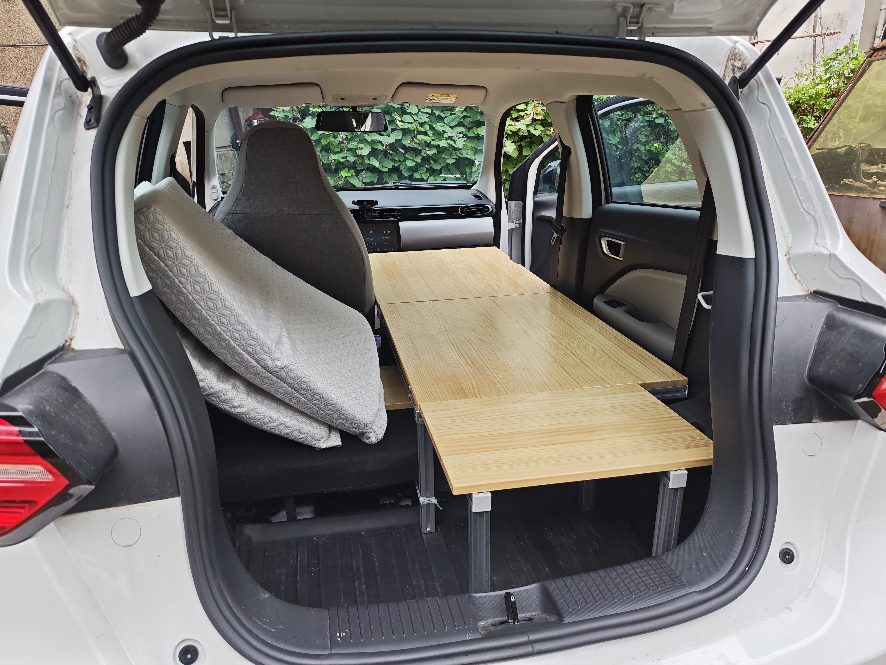

# Leapmotor-T03-Camping-Car
零跑T03的床车改造

视频教程见账号“康康的生活志”，抖音、小红书、b站都是这个名字

## 一、效果预览

行车状态

折平副驾

搭上前部木板

办公状态（折平副驾后直接放上小桌板也可以进入办公状态）

睡眠状态

## 二、改副驾

**需求**
1. 能往前折平，使得有足够的长度铺床
2. 以后轮轮拱上沿作为床铺的顶面，副驾折叠后不能高于这个高度

**改造教程**

| 步骤         | 需要的配件                                                                                                  | 需要的工具                                                                                                   | 具体流程                                                                                                                       | 注意事项                                                                                                                                                                                                           |
| -------------- | ------------------------------------------------------------------------------------------------------------- | -------------------------------------------------------------------------------------------------------------- | -------------------------------------------------------------------------------------------------------------------------------- | -------------------------------------------------------------------------------------------------------------------------------------------------------------------------------------------------------------------- |
| 1 拆原副驾   | null                                                                                                        | T50梅花扳手                                                                                                  | 拧下螺栓即可                                                                                                                   | 注意前面两个螺栓的工具限制 有锁紧标志线，存放时区分四个角                                                                                                                                                        |
| 2 制作转接片 | 镀锌钢条：宽80mm厚6mm长1000mm                                                                               | 角磨机（切割片、百叶轮打磨片） 电钻（至少要一个10mm钻头）                                                  | 将钢条切成图中的长度并打磨 钻孔                                                                                              | 打孔位置图在表格下方 铝条可能更方便加工，但强度不一定够，而且价格更贵 图中打孔位置不是很准，可以通过增大孔径消除误差 打孔时，可以先打小孔，再扩到中孔，最后扩到大孔 打孔时会滑，可以用中心冲                  |
| 3 安装转接片 | 高强度外六角螺栓：3个m10x30，1个m10x65 三种垫片 ：尼龙垫片 10x20x1.5，薄钢垫片 10x20x2，厚钢垫片 10x20x5  | 16mm套筒（拧外六角螺栓）                                                                                     | 从下往上 右后：1个尼龙+6个薄垫片+钢条+30外六角 其他三处：1个尼龙+9个厚垫片+钢条+65外六角                                    | 钢垫片和车之间加一个尼龙垫片，保护作用，可以不加                                                                                                                                                                  |
| 4 改造新副驾 | 宝骏E300副驾座椅（参考价格300）                                                                            | 角磨机（切定位销和限位器） 斜口钳（拆座椅套） 十字螺丝刀（拆座椅塑料壳螺丝） 一字螺丝刀（撬座椅塑料壳）  | 切掉定位销并打磨 右后侧切掉一块底座（避开外六角螺栓的头） 拆洗座椅套和海绵（斜口钳剪掉铁丝环） 拆除保护罩并切割前折的限位  | 后两步的拆除为破坏性的，但是问题不大 不切限位的话，靠背无法完全水平，还是有一点点斜，后续放小桌板也麻烦些 我买到的座椅味道很大，所以直接拆了海绵方便清洗 不拆海绵的话，不确定前折的限位方不方便切，感觉比较难  |
| 5 安装新副驾 | 4个m10法兰螺母 4个m10x25高强度内六角螺栓 薄钢垫片（同上）                                                | 角磨机 8mm内六角扳手（拧内六角螺栓）                                                                       | 从下往上 法兰螺母+钢条+座椅支架+薄垫片+内六角螺栓                                                                             | 左前螺母，头磨薄（不挡滑轨）；同时长度磨短或者增加薄垫圈 如果左前侧塞不进去法兰螺母，可以在安装转接片时适当加垫圈 左后导轨上的塑料档口需要掰掉，否则会干涉到螺栓头                                               |
| 6 副驾垫高   | 木板 泡沫地垫                                                                                              | null                                                                                                         | 将木板垫在靠背钢条的后面，并放入裁剪合适的泡沫地垫，方便后续在上面放床板                                                       | 最下面的木板必须要，座椅背部就几根钢丝，需要木板提供支持 木板尺寸30x36 泡沫垫数量根据实际情况调整                                                                                                               |

钢条尺寸与打孔位置（黑点为打孔位置，上面的是左侧的）

钢条安装后效果图

部分配件购买截图，哪家便宜买哪家，不用拆我的

**补充说明**
1. 不算工具的话，整体成本不到400
2. 座椅毕竟是二手，我买到的座椅味道巨大，一股汽油、油漆的味道，洗了之后还是有一些，有点烦，大家买的时候注意点
3. 改造后的副驾高了一大截，座垫高度和整个座椅的高度都增加了，后者很容易被帽子叔叔看出来，建议套个和主驾一样的座椅套，但是这样大概率会影响折平，所以估计要同时再削掉一些海绵才行
4. 主驾改了也无法折平，会被方向盘挡住，要宝骏rm5中排座椅这种头枕可拆卸的才行
5. 主驾侧的螺丝位置、高度等不确定是不是一致的，改的话要自己确认下
6. 宝骏rm5中排座椅可能是更优解，但是缺货买不到

## 三、做床架

**需求**
1. 足够稳固，纯平，尽可能长，尽可能宽，能放50cm的枕头
2. 副驾部分能快速展开和收纳，且不用下车（方便雨天铺床，人生第一次自驾游露营就被狠狠教育了），后排座椅可以比较方便地复原（应对帽子叔叔）
3. 不影响主驾后仰小憩

**床架**
1. 尺寸：长185宽60，中间部分和车顶距离71，床的上表面与轮拱最上沿齐平
2. 材料为铝型材+木板，牢固环保无甲醛，分三个部分
3. 前部通过两边的角码限制住上下移动，能快速拆装且足够稳固，每天铺床收床只需要动这一部分就行
4. 中部的木板仅通过角码限制位置，可以轻松取下
5. 后部能较方便地拆除，之后就能复原后排座椅了

**注意**
1. 需要拆掉后排坐垫，坐垫可以带上，也可以赌一把，建议加上座椅套增加瞒天过海的成功率，可以自制海绵坐垫再次增加成功率
2. 安全带往下拉一拉，塞到靠背下面
3. 扎带固定，防止位移

**图纸分享**
1. 铝型材框架图纸（见文件“床车铝型材框架.scene”，需要用软件“MayCAD”打开，可以找找相关教程）（我车上有脚垫、后备箱垫，所以尺寸不是适合所有人的）
2. 除了铝型材的图纸，还需要搭配其他配件，内容很多很多，后面单独出教程
3. 木板（一张48x33，两张76x60）

## 四、床架的详细制作教程（编写中）

本节视频在账号“康康的造物集”中更新

铝型材框架

链接方案：钻孔 攻丝 弹性扣件

端盖

脚杯

连接木板

前中部链接

## 其他车辆相关的改装/装备（编写中）

车顶行李箱：不考虑。风燥大、能耗高、需要备案（改了宽胎要换回去）

前备箱：买了但闲置了。国庆期间自驾游用过一次，高速上遇到了过热充电只有10kw的问题，不确定是因为前备箱还是天气太热；还有个原因是装不了多少东西，并且没有多少合适的东西可以放外面，有点鸡肋的感觉

宽胎：换了185/60r15的胎（好像没有蹭到，所以就没有切割轮拱罩），提车没几天就换了，所以无法对比，有几次差点追尾，宽胎还是有必要的，虽然会增加能耗

移动电源：打算买大疆power500，作为电量蓄水池、功率放大器、接口拓展器，不需要多大的容量和功率，通过点烟器接出的typec线给移动电源充电（power1000v2不支持typec充电，想通过点烟器充电只能买专门的线，300块，太贵辣）；正浩和大疆选了后者，大疆功率更高、噪音更低、用料更好，并且对大疆更有好感；某三字品牌到处都是水军，太下头了，狗都不买；

小桌板：30x90木板，左侧搭在门的扶手上，右侧搭在副驾放倒后的平面上，高度刚刚好，如果副驾已经搭上了睡觉的木板，则用泡沫地垫垫高左侧

中控储物：14宽21深15高的收纳盒，需要裁切，上面可以再放一个定制的收纳盒

行车记录仪&流媒体后视镜：好用，推荐

主驾扶手：医疗包卡在主副驾中间，充当扶手，也方便拿取

## 床车改造的说明&答疑（编写中）

1. “自驾游”并非“旅居”，所以不会在车上做饭、洗澡、洗衣服、上厕所等，车只是作为一个办公、休息和睡觉的地方。洗澡通过健身房、洗浴中心、司机之家等解决，洗衣服通过多带几套衣服+华住解决
2. 因为车的cltc只有300，所以不会去环境恶劣的地方，如新疆、西藏、冬天的东北等，这些地方等换了车再考虑🐶
3. 另外的找平方案，比如用盒子垫着，先不说合适尺寸的盒子好不好找，中间段靠后排座椅的海绵支撑，绝对是不够稳固的，拉丝床垫的话，要充气放气，很麻烦
4. 主驾放鞋，可以防止鞋子被偷

## 装备分享（编写中）

说明

1. 想精简装备，可以参考重装徒步，在其基础上更换、增加。再参考床车博主查漏补缺即可
2. 各种装备在日常用车场景下加，并且尽量是模块化（一个包/一个箱子）地加，不然零零散散收拾起来太麻烦了，所以我不喜欢各种缝隙/犄角旮旯塞东西

睡眠：遮光板 照明 床垫 睡袋 抓绒睡袋 枕头
饮食：
洗漱：
数码：

遮光板的方向，外黑内银更不容易被注意到，车内的温度更高、光线更好；外银内黑能反射

## 更合理的床车布局（编写中）

两大类：睡前排or睡后备箱

下方的例子均为单人

睡后备箱

说明：后排座椅的坐垫下沉，靠背折叠后基本平整
举例：零跑c16五座版
优点：坐垫下沉所以有足够的坐高；不需要每天铺床，副驾和睡眠区域的另外半边都可以长期放东西
缺点：只适合单人，多人时，需要频繁搬动物品；

睡前排

说明：副驾可以向后折平；第二排座椅下方有滑轨，整个二排可以向后移动
举例：有三排的mvp或者大suv可能有这种设计，但五座的好像没见过，没具体了解
优点
可以利用主驾的功能（后仰通风加热按摩等），比后排座椅更方便、舒适
二排座椅向后滑可提供更大的睡眠长度；此方案的坐高也能得到保证
后备箱正常使用，日常睡眠不需要动后备箱
可以兼容多人
缺点
需要每天铺床