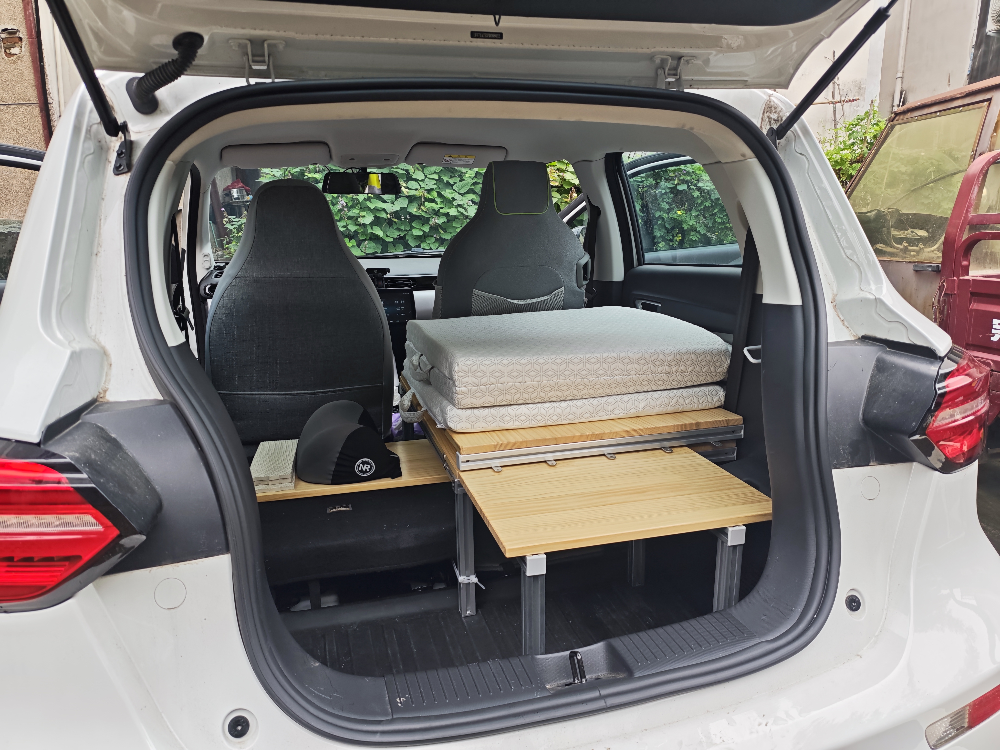

# Leapmotor-T03-Camping-Car
零跑T03的床车改造

## 一、效果预览

行车状态

折平副驾

搭上前部木板

铺上床垫

## 二、改副驾

**需求**
1. 能往前折平，使得有足够的长度铺床
2. 折屏后高度不能高于后轮轮拱，使得有尽可能大的起身空间

**改造教程**
| 步骤         | 需要的配件                                                                                                                          | 需要的工具                                                   | 具体流程                                                                                                                       | 注意事项                                                                                                                                                                   |
| -------------- | ------------------------------------------------------------------------------------------------------------------------------------- | -------------------------------------------------------------- | -------------------------------------------------------------------------------------------------------------------------------- | ---------------------------------------------------------------------------------------------------------------------------------------------------------------------------- |
| 1 拆原副驾   | null                                                                                                                                | T50梅花扳手                                                  | 拧下螺栓即可                                                                                                                   | 注意前面两个螺栓的工具限制 有锁紧标志线，存放时区分四个角                                                                                                                |
| 2 制作转接片 | 镀锌钢条：宽80mm厚6mm长1000mm                                                                                                       | 角磨机（切割片、百叶轮打磨片） 电钻（至少要一个10mm钻头）  | 将钢条切成图中的长度并打磨 钻孔                                                                                              | 铝条可能更方便加工，但强度不一定够，而且价格更贵 图中打孔位置不是很准，可以通过增大孔径消除误差 打孔时，可以先打小孔，再扩到中孔，最后扩到大孔 打孔时会滑，可以用中心冲 |
| 3 安装转接片 | 高强度外六角螺栓：3个m10x30，1个m10x65 三种垫片 ：尼龙垫片 10x20x1.5，薄钢垫片 10x20x2，厚钢垫片 10x20x5  | 16mm套筒                                                     | 从下往上 右后：1个尼龙+6个薄垫片+钢条+30外六角 其他三处：1个尼龙+9个厚垫片+钢条+65外六角                                    | 钢垫片和车之间加一个尼龙垫片，保护作用，可以不加                                                                                                                          |
| 4 改造新副驾 | 宝骏E300副驾座椅                                                                                                                    | 角磨机 斜口钳 十字螺丝刀                                   | 切掉定位销并打磨 右后侧切掉一块底座（避开外六角螺栓的头） 拆洗座椅套和海绵（斜口钳剪掉铁丝环） 拆除保护罩并切割前折的限位  | 后两步的拆除为破坏性的，但是问题不大 我买到的座椅味道很大，所以直接拆了海绵方便清洗 不拆海绵的话，不确定前折的限位方不方便切，感觉比较难                                |
| 5 安装新副驾 | 4个法兰螺母m10 4个高强度内六角螺栓m10x25 薄钢垫片（同上）                                                                     | 8mm内六角扳手                                                | 从下往上 法兰螺母+钢条+座椅支架+薄垫片+内六角螺栓                                                                             | 左前螺母，头磨薄（不挡滑轨），长度磨短或者增加薄垫圈 如果左前侧塞不进去法兰螺母，可以在安装转接片时适当加垫圈                                                            |

**缺点**
1. 座椅毕竟是二手，我买到的座椅味道巨大，一股汽油、油漆的味道，洗了之后还是有一些，有点烦
2. 改造后的副驾高了一大截，座垫高度和整个座椅的高度都增加了，后者很容易被帽子叔叔看出来，建议套个和主驾一样的座椅套

## 三、做床架

**需求**
1. 足够稳固，纯平，尽可能长，尽可能宽，能放50cm的枕头
2. 副驾部分能快速展开和收纳，且不用下车（方便雨天铺床），后排座椅可以比较方便地复原（应对帽子叔叔）
3. 不影响主驾后仰小憩

**床架**
1. 尺寸：长185宽60，中间部分和车顶距离71，床的上表面与轮拱最上沿齐平
2. 材料为铝型材+木板，牢固环保无甲醛，分三个部分
3. 前部通过两边的角码限制住上下移动，能快速拆装且足够稳固，每天铺床收床只需要动这一部分就行
4. 中部的木板仅通过角码限制位置，可以轻松取下
5. 后部能较方便地拆除，之后就能复原后排座椅了

**注意**
1. 副驾需要垫高，确保前部的木板和后面的齐平，木板（尺寸30x36）+泡沫地垫
2. 需要拆掉后排坐垫，坐垫可以带上，也可以赌一把，建议加上座椅套增加瞒天过海的成功率，可以自制海绵坐垫再次增加成功率

**图纸分享**
1. 铝型材框架图纸（见文件“床车铝型材框架.scene”），除了铝型材的图纸，还需要搭配其他配件，内容较多，有必要的话后面单独出教程（车上有脚垫、后备箱垫，所以尺寸不是适合所有人的）
2. 木板（一张48x33，两张76x60）

## 其他车辆相关的改装/装备

车顶行李箱：不考虑。风燥大、能耗高、需要备案（改了宽胎要换回去）

前备箱：买了但闲置了。国庆期间自驾游用过一次，高速上遇到了过热充电只有10kw的问题，不确定是因为前备箱还是天气太热；还有个原因是装不了多少东西，并且没有多少合适的东西可以放外面，有点鸡肋的感觉

宽胎：换了185/60r15的胎（好像没有蹭到，所以就没有切割轮拱罩），提车没几天就换了，所以无法对比，有几次差点追尾，宽胎还是有必要的，虽然会增加能耗

移动电源：打算买大疆power500，作为电量蓄水池、功率放大器、接口拓展器，不需要多大的容量和功率，通过点烟器接出的typec线给移动电源充电（power1000v2不支持typec充电，想通过点烟器充电只能买专门的线，300块，太贵辣）；正浩和大疆选了后者，大疆功率更高、噪音更低、用料更好，并且对大疆更有好感；某三字品牌到处都是水军，太下头了，狗都不买；

小桌板：30x90木板，左侧搭在门的扶手上，右侧搭在副驾放倒后的平面上，高度刚刚好，如果副驾已经搭上了睡觉的木板，则用泡沫地垫垫高左侧

中控储物：14宽21深15高的收纳盒，需要裁切，上面可以再放一个定制的收纳盒

行车记录仪&流媒体后视镜：好用，推荐

主驾扶手：医疗包卡在主副驾中间，充当扶手，也方便拿取

## 一些说明

1. “自驾游”并非“旅居”，所以不会在车上做饭、洗澡、洗衣服、上厕所等，车只是作为一个办公和睡觉的地方。洗澡通过健身房、洗浴中心、司机之家等解决，洗衣服通过多带几套衣服+华住解决
2. 基本装备参考重装徒步，在其基础上更换、增加。再参考床车博主查漏补缺即可
3. 各种装备在日常用车场景下加，并且尽量是模块化（一个包/一个箱子）地加，不然零零散散收拾起来太麻烦了，所以我不喜欢各种缝隙/犄角旮旯塞东西
4. 找平的方案，就算是盒子垫着，先不说合适尺寸的盒子好不好找，中间段靠后排座椅的海绵支撑，绝对是不够稳固的，拉丝床垫的话，要充气放气，麻烦
5. 主驾放鞋，防止鞋子被偷
